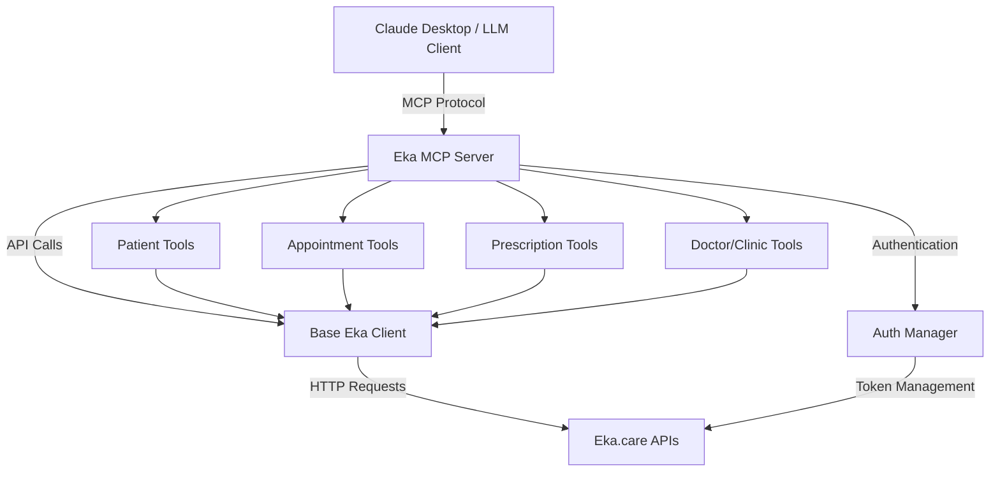

## Overview

The **Eka.care MCP SDK** is a self-hosted Model Context Protocol (MCP) server that bridges Eka.care's comprehensive healthcare APIs with Large Language Models like Claude Desktop, OpenAI, and other AI applications. It enables seamless integration of patient management, appointment scheduling, digital prescriptions, and medical records into AI-powered workflows.

### What is Model Context Protocol (MCP)?

Model Context Protocol is an open standard that enables AI applications to securely connect with external data sources and tools. MCP servers act as intermediaries that translate LLM requests into API calls, allowing AI assistants to interact with real-world systems through structured, type-safe interfaces.

### Key Features

<CardGroup cols={2}>
  <Card title="Self-Hosted Deployment" icon="server">
    Clean, simple deployment for healthcare organizations with full control over data and infrastructure
  </Card>
  <Card title="Modular Architecture" icon="puzzle-piece">
    Easily extend with additional API modules and customize to your needs
  </Card>
  <Card title="Secure Authentication" icon="lock">
    Client ID/Secret + optional API key authentication for secure access
  </Card>
  <Card title="LLM-Optimized" icon="robot">
    Structured responses optimized for LLM consumption with comprehensive error handling
  </Card>
</CardGroup>

## Supported API Modules

### Doctor Tools
The SDK currently supports comprehensive doctor-facing tools:

- **Patient Management**: Create, update, and search patient profiles
- **Appointment Management**: Book, update, cancel, and retrieve appointments with slot availability
- **Digital Prescriptions**: Generate and manage digital prescriptions with medication details
- **Doctor & Clinic Info**: Retrieve doctor profiles, clinic details, and services offered

## Quick Start

### Installation

<CodeGroup>
```bash UV (Recommended)
# Clone the repository
git clone https://github.com/eka-care/eka-mcp-sdk.git
cd eka-mcp-sdk

# Install with UV
uv sync

# Activate the virtual environment
source .venv/bin/activate  # macOS/Linux
.venv\Scripts\activate     # Windows
```

```bash Pip
# Clone the repository
git clone https://github.com/eka-care/eka-mcp-sdk.git
cd eka-mcp-sdk

# Install with pip
pip install -e .
```
</CodeGroup>

### Configuration

Create a `.env` file in the project root:

```env
# API Configuration
EKA_API_BASE_URL=https://api.eka.care

# Authentication (get from ekaconnect@eka.care)
EKA_CLIENT_ID=your_client_id
EKA_CLIENT_SECRET=your_client_secret
EKA_API_KEY=your_api_key

# Server configuration
EKA_MCP_SERVER_HOST=localhost
EKA_MCP_SERVER_PORT=8000
EKA_LOG_LEVEL=INFO
```

<Note>
To obtain your credentials, please contact **ekaconnect@eka.care** with your organization details.
</Note>

### Running the Server

```bash
# Activate virtual environment
source .venv/bin/activate  # macOS/Linux

# Run the MCP server
eka-mcp-server

# Or alternatively
python -m eka_mcp_sdk.server
```

The server will start and expose MCP tools for all configured API modules.

## Integration with Claude Desktop

To use the Eka.care MCP SDK with Claude Desktop, add the following configuration to your Claude Desktop MCP settings:

<Warning>
**Important**: Use the full absolute path to the virtual environment's Python executable, not just `python` or `eka-mcp-server`.
</Warning>

### Finding Your Python Path

```bash
# Activate your virtual environment first
source .venv/bin/activate

# Get the full path to Python
which python  # macOS/Linux
where python  # Windows
```

### Claude Desktop Configuration

<CodeGroup>
```json macOS/Linux
{
  "mcpServers": {
    "eka-care": {
      "command": "/absolute/path/to/eka-mcp-sdk/.venv/bin/python",
      "args": ["-m", "eka_mcp_sdk.server"],
      "env": {
        "EKA_CLIENT_ID": "your_client_id",
        "EKA_CLIENT_SECRET": "your_client_secret",
        "EKA_API_KEY": "your_api_key"
      }
    }
  }
}
```

```json Windows
{
  "mcpServers": {
    "eka-care": {
      "command": "C:\\absolute\\path\\to\\eka-mcp-sdk\\.venv\\Scripts\\python.exe",
      "args": ["-m", "eka_mcp_sdk.server"],
      "env": {
        "EKA_CLIENT_ID": "your_client_id",
        "EKA_CLIENT_SECRET": "your_client_secret",
        "EKA_API_KEY": "your_api_key"
      }
    }
  }
}
```
</CodeGroup>

### Configuration File Locations

<AccordionGroup>
  <Accordion title="macOS">
    ```
    ~/Library/Application Support/Claude/claude_desktop_config.json
    ```
  </Accordion>
  <Accordion title="Windows">
    ```
    %APPDATA%\Claude\claude_desktop_config.json
    ```
  </Accordion>
  <Accordion title="Linux">
    ```
    ~/.config/Claude/claude_desktop_config.json
    ```
  </Accordion>
</AccordionGroup>

## Available Tools

The MCP SDK exposes comprehensive tools organized by priority. The SDK uses a smart tool prioritization system that recommends enriched tools (with full context) over basic tools (IDs only).

### Patient Management Tools

<ResponseField name="create_patient_profile" type="tool">
  Create a new patient profile with demographics and contact information.
  
  **Parameters:**
  - `patient_data`: Patient details including name, DOB, gender, mobile, email
  
  **Returns:** Patient profile with generated patient ID
</ResponseField>

<ResponseField name="search_patients" type="tool">
  Search for patients by mobile number, username, or name with prefix matching.
  
  **Parameters:**
  - `prefix`: Search term (mobile/username/name)
  - `limit`: Max results (default: 50)
  
  **Returns:** List of matching patient profiles
</ResponseField>

<ResponseField name="get_comprehensive_patient_profile" type="tool">
  🌟 **RECOMMENDED**: Get complete patient profile with full medical history and appointment associations.
  
  **Parameters:**
  - `patient_id`: Patient's unique identifier
  
  **Returns:** Comprehensive patient data with medical history
</ResponseField>

<ResponseField name="update_patient_profile" type="tool">
  Update existing patient profile details.
  
  **Parameters:**
  - `patient_id`: Patient's unique identifier
  - `update_data`: Fields to update
  
  **Returns:** Updated patient profile
</ResponseField>

### Appointment Management Tools

<ResponseField name="get_available_slots" type="tool">
  Get available appointment slots for a doctor at a specific clinic and date.
  
  **Parameters:**
  - `doctor_id`: Doctor's unique identifier
  - `clinic_id`: Clinic's unique identifier
  - `date`: Date in YYYY-MM-DD format
  
  **Returns:** List of available time slots
</ResponseField>

<ResponseField name="book_appointment" type="tool">
  Book an appointment slot for a patient.
  
  **Parameters:**
  - `appointment_data`: Appointment details including patient, doctor, timing, mode
  
  **Returns:** Created appointment with confirmation
</ResponseField>

<ResponseField name="get_appointments_enriched" type="tool">
  🌟 **RECOMMENDED**: Get appointments with comprehensive details including patient names, doctor profiles, and clinic information.
  
  **Parameters:**
  - `doctor_id`: Optional doctor filter
  - `clinic_id`: Optional clinic filter
  - `patient_id`: Optional patient filter
  - `start_date`: Filter from date (YYYY-MM-DD)
  - `end_date`: Filter to date (YYYY-MM-DD)
  - `page_no`: Page number for pagination
  
  **Returns:** Appointments with full patient, doctor, and clinic context
</ResponseField>

<ResponseField name="update_appointment" type="tool">
  Update an existing appointment's details.
  
  **Parameters:**
  - `appointment_id`: Appointment's unique identifier
  - `update_data`: Fields to update
  
  **Returns:** Updated appointment details
</ResponseField>

<ResponseField name="cancel_appointment" type="tool">
  Cancel an appointment.
  
  **Parameters:**
  - `appointment_id`: Appointment's unique identifier
  - `reason`: Cancellation reason
  
  **Returns:** Cancellation confirmation
</ResponseField>

### Prescription Management Tools

<ResponseField name="get_comprehensive_prescription" type="tool">
  🌟 **RECOMMENDED**: Get complete prescription details with patient, doctor, and clinic information.
  
  **Parameters:**
  - `prescription_id`: Prescription's unique identifier
  
  **Returns:** Full prescription with medications, diagnosis, and context
</ResponseField>

### Doctor & Clinic Tools

<ResponseField name="get_business_entities" type="tool">
  Get all clinics and doctors for the authenticated business.
  
  **Returns:** List of clinics and associated doctors
</ResponseField>

<ResponseField name="get_comprehensive_doctor_profile" type="tool">
  Get complete doctor profile with clinic associations and services offered.
  
  **Parameters:**
  - `doctor_id`: Doctor's unique identifier
  
  **Returns:** Doctor profile with specializations and clinic details
</ResponseField>

<ResponseField name="get_comprehensive_clinic_details" type="tool">
  Get complete clinic details with associated doctors.
  
  **Parameters:**
  - `clinic_id`: Clinic's unique identifier
  
  **Returns:** Clinic details with doctor associations
</ResponseField>

<Note>
**Tool Selection**: The SDK includes both comprehensive (enriched) and basic tools. Comprehensive tools are recommended as they provide complete context without additional API calls. Basic tools are available for specific use cases requiring minimal data.
</Note>

## Usage Examples

### Example 1: Patient Registration and Appointment Booking

```python
from eka_mcp_sdk.clients.doctor_tools_client import DoctorToolsClient
from eka_mcp_sdk.config.settings import Settings

# Initialize client
settings = Settings()
client = DoctorToolsClient(
    base_url=settings.eka_api_base_url,
    client_id=settings.eka_client_id,
    client_secret=settings.eka_client_secret
)

# Create patient profile
patient = await client.create_patient({
    "name": "John Doe",
    "mobile": "+919876543210",
    "date_of_birth": "1990-01-15",
    "gender": "male",
    "email": "john.doe@example.com"
})

# Get available slots
slots = await client.get_appointment_slots(
    doctor_id="doc-123",
    clinic_id="clinic-456",
    date="2024-01-20"
)

# Book appointment
appointment = await client.book_appointment({
    "doctor_id": "doc-123",
    "patient_id": patient["patient_id"],
    "clinic_id": "clinic-456",
    "appointment_date": "2024-01-20",
    "appointment_time": "10:30",
    "appointment_type": "consultation",
    "mode": "in-person"
})
```

### Example 2: Using with Claude Desktop

Once configured, you can interact with Claude Desktop naturally:

<Frame>
  
</Frame>

**User:** "Book an appointment for patient John Doe with Dr. Smith on January 20th at 10:30 AM"

**Claude:** *Uses the MCP tools to:*
1. Search for the patient by name
2. Check available slots for Dr. Smith
3. Book the appointment
4. Confirm the booking with details

### Example 3: CrewAI Integration

```python
from crewai import Agent, Task, Crew
from eka_mcp_sdk.lib import get_eka_tools

# Get Eka.care tools for CrewAI
eka_tools = get_eka_tools()

# Create an agent with Eka.care tools
medical_assistant = Agent(
    role="Medical Assistant",
    goal="Manage patient appointments and records efficiently",
    backstory="Expert in healthcare operations with access to Eka.care systems",
    tools=eka_tools,
    verbose=True
)

# Create a task
task = Task(
    description="""
    Book an appointment for patient ID patient-789 with doctor ID doc-456
    at clinic clinic-123 on January 20, 2024 at 10:30 AM for a consultation.
    """,
    agent=medical_assistant,
    expected_output="Appointment booking confirmation"
)

# Execute
crew = Crew(agents=[medical_assistant], tasks=[task])
result = crew.kickoff()
```

## Building Hosted Solutions

The SDK is designed to be modular and reusable. You can import core components to build more complex hosted MCP solutions:

```python
from eka_mcp_sdk.core import (
    BaseEkaClient,
    DoctorToolsClient,
    AuthContext,
    EkaAPIError
)

# Use these components in your hosted MCP implementation
# Add multi-tenant capabilities
# Implement custom authentication flows
# Build workspace isolation
```

This architecture enables:
- **Multi-tenancy**: Support multiple organizations/workspaces
- **Custom Auth**: Implement organization-specific authentication
- **Workspace Isolation**: Separate data access per workspace
- **Custom Modules**: Add organization-specific API modules

## Development

### Setup Development Environment

```bash
# Clone the repository
git clone https://github.com/eka-care/eka-mcp-sdk.git
cd eka-mcp-sdk

# Install with development dependencies
uv sync --extra dev

# Run tests
uv run pytest

# Format code
uv run black .
uv run isort .

# Type checking
uv run mypy .
```

### Adding New API Modules

1. **Create Client**: Add new client in `eka_mcp_sdk/clients/`
2. **Implement Tools**: Create MCP tools in `eka_mcp_sdk/tools/`
3. **Register Tools**: Update tool registration in `server.py`
4. **Update Docs**: Add documentation for new tools

Example structure:
```python
# eka_mcp_sdk/clients/my_module_client.py
from .base import BaseEkaClient

class MyModuleClient(BaseEkaClient):
    async def my_api_call(self, param: str) -> dict:
        return await self._make_request(
            "POST",
            "/my/endpoint",
            json={"param": param}
        )

# eka_mcp_sdk/tools/my_module_tools.py
from fastmcp import FastMCP

def register_my_module_tools(mcp: FastMCP, client: MyModuleClient):
    @mcp.tool()
    async def my_tool(param: str) -> dict:
        """Tool description for LLM"""
        return await client.my_api_call(param)
```

### Virtual Environment Management

```bash
# Create/update virtual environment
uv sync

# Add a new dependency
uv add package_name

# Add a development dependency
uv add --dev package_name

# Run commands in the virtual environment
uv run pytest
uv run python examples/direct_usage.py
```

## Configuration Reference

| Environment Variable | Description | Default | Required |
|---------------------|-------------|---------|----------|
| `EKA_API_BASE_URL` | Eka.care API base URL | `https://api.eka.care` | No |
| `EKA_CLIENT_ID` | Client ID from Eka.care | - | Yes |
| `EKA_CLIENT_SECRET` | Client secret from Eka.care | - | Yes |
| `EKA_API_KEY` | API key for additional auth | - | Yes |
| `EKA_MCP_SERVER_HOST` | MCP server host | `localhost` | No |
| `EKA_MCP_SERVER_PORT` | MCP server port | `8000` | No |
| `EKA_LOG_LEVEL` | Logging level (DEBUG/INFO/WARNING/ERROR) | `INFO` | No |

## Architecture

### System Overview



### Key Components

<CardGroup cols={2}>
  <Card title="MCP Server" icon="server">
    FastMCP-based server that exposes healthcare APIs as MCP tools with automatic tool registration and prioritization
  </Card>
  <Card title="Authentication Manager" icon="key">
    Handles OAuth2 authentication with Eka.care APIs, token refresh, and session management
  </Card>
  <Card title="Base Client" icon="plug">
    Reusable HTTP client with error handling, retry logic, and authentication injection
  </Card>
  <Card title="Tool Modules" icon="tools">
    Organized collections of MCP tools for different API domains with enriched and basic variants
  </Card>
</CardGroup>

## Error Handling

The SDK provides comprehensive error handling with direct forwarding of Eka.care API errors:

```python
from eka_mcp_sdk.clients.base import EkaAPIError

try:
    patient = await client.get_patient("invalid-id")
except EkaAPIError as e:
    print(f"Error: {e.message}")
    print(f"Status Code: {e.status_code}")
    print(f"Error Code: {e.error_code}")
```

Common error scenarios:
- **Authentication Errors**: Invalid credentials or expired tokens
- **Validation Errors**: Invalid input parameters or missing required fields
- **Not Found Errors**: Requested resource doesn't exist
- **Rate Limiting**: Too many requests to the API
- **Server Errors**: Eka.care API issues

## Best Practices

<AccordionGroup>
  <Accordion title="Use Comprehensive Tools" icon="star">
    Prefer comprehensive (enriched) tools over basic tools for better LLM context. They provide complete information without additional API calls.
    
    ✅ Use `get_appointments_enriched`  
    ❌ Use `get_appointments_basic` + multiple lookup calls
  </Accordion>
  
  <Accordion title="Implement Error Handling" icon="shield-check">
    Always handle API errors gracefully and provide meaningful feedback to users.
    
    ```python
    try:
        result = await client.book_appointment(data)
    except EkaAPIError as e:
        if e.status_code == 404:
            return "Patient or doctor not found"
        elif e.status_code == 400:
            return f"Invalid data: {e.message}"
        else:
            return "An error occurred, please try again"
    ```
  </Accordion>
  
  <Accordion title="Secure Credentials" icon="lock">
    Never commit credentials to version control. Always use environment variables or secure credential management systems.
    
    - Use `.env` files for local development
    - Use secret management services for production
    - Rotate credentials regularly
  </Accordion>
  
  <Accordion title="Test with Mock Data" icon="flask">
    Test your MCP integration with sample data before deploying to production.
    
    ```python
    # Use test credentials for development
    EKA_CLIENT_ID=test_client_id
    EKA_CLIENT_SECRET=test_client_secret
    EKA_API_BASE_URL=https://api-dev.eka.care
    ```
  </Accordion>
</AccordionGroup>

## Troubleshooting

<AccordionGroup>
  <Accordion title="Claude Desktop Can't Connect">
    **Issue**: Claude Desktop shows "Connection refused" or "Server not starting"
    
    **Solutions**:
    1. Verify you're using the full absolute path to the Python executable
    2. Check that the virtual environment is created: `ls -la .venv/bin/python`
    3. Test the server manually: `source .venv/bin/activate && eka-mcp-server`
    4. Check Claude Desktop logs for specific error messages
  </Accordion>
  
  <Accordion title="Authentication Errors">
    **Issue**: "Invalid credentials" or "Unauthorized" errors
    
    **Solutions**:
    1. Verify credentials are correct in `.env` or Claude config
    2. Check if credentials have expired - contact ekaconnect@eka.care
    3. Ensure `EKA_API_KEY` is provided if required
    4. Test credentials with direct API call: `curl -X POST https://api.eka.care/auth/token`
  </Accordion>
  
  <Accordion title="Import Errors">
    **Issue**: "ModuleNotFoundError" or import failures
    
    **Solutions**:
    1. Ensure virtual environment is activated: `source .venv/bin/activate`
    2. Reinstall dependencies: `uv sync` or `pip install -e .`
    3. Check Python version: `python --version` (requires 3.10+)
    4. Verify installation: `pip list | grep eka-mcp-sdk`
  </Accordion>
  
  <Accordion title="Tool Not Working in Claude">
    **Issue**: Tool appears but doesn't work correctly
    
    **Solutions**:
    1. Check server logs for error messages: `tail -f ~/.local/state/eka-mcp-sdk/logs/server.log`
    2. Test the tool directly with the API client
    3. Verify input parameters match the tool schema
    4. Check if API endpoint is available: Check API status page
  </Accordion>
</AccordionGroup>

## Resources

<CardGroup cols={2}>
  <Card title="API Documentation" icon="book" href="https://developer.eka.care">
    Complete API reference and guides
  </Card>
  <Card title="GitHub Repository" icon="github" href="https://github.com/eka-care/eka-mcp-sdk">
    Source code, issues, and contributions
  </Card>
</CardGroup>

## License

MIT License - see [LICENSE](https://github.com/eka-care/eka-mcp-sdk/blob/main/LICENSE) file for details.

## Contributing

We welcome contributions!

---

<Note>
**Need Help?** If you have questions or need assistance with the Eka.care MCP SDK, please reach out to **ekaconnect@eka.care**.
</Note>
