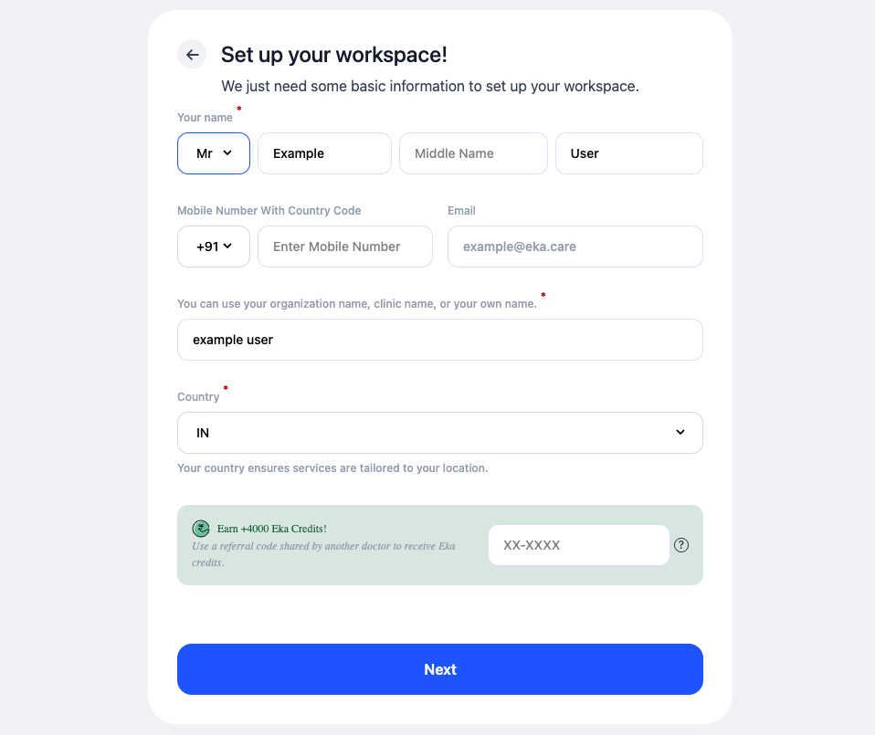
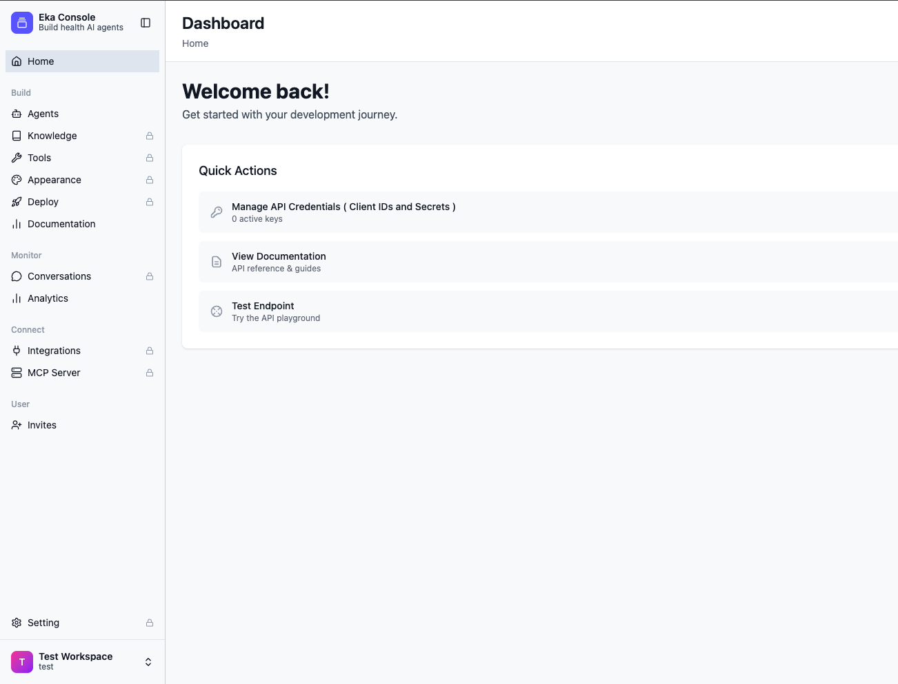
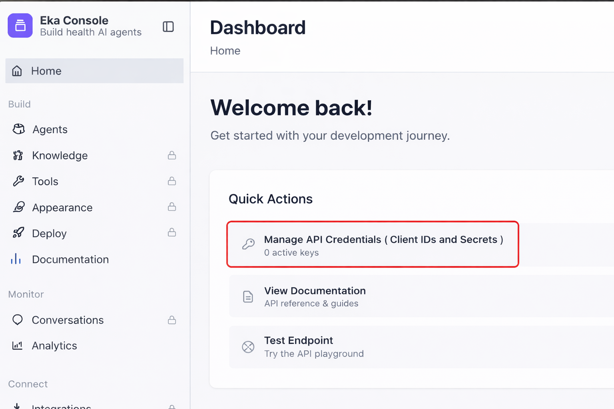
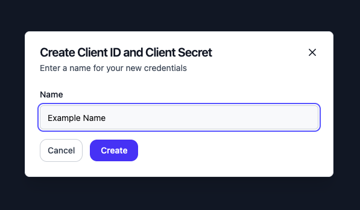
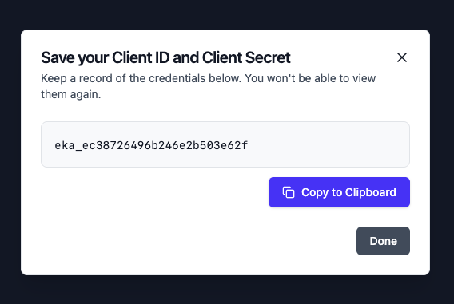
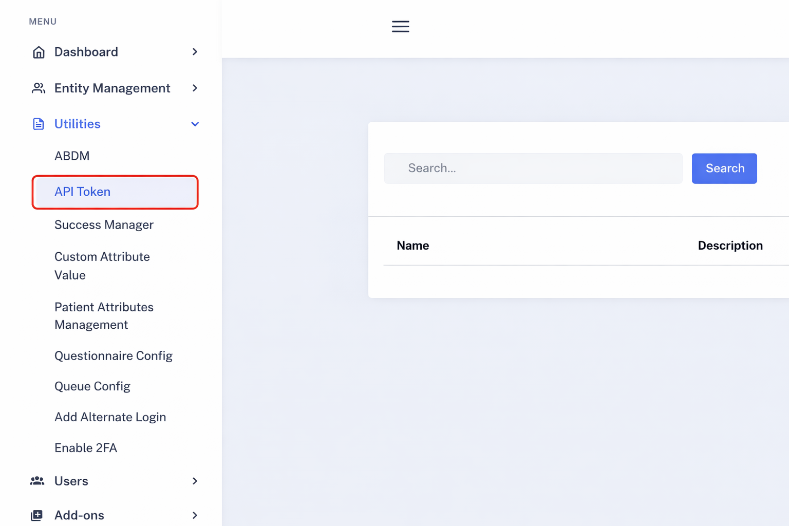
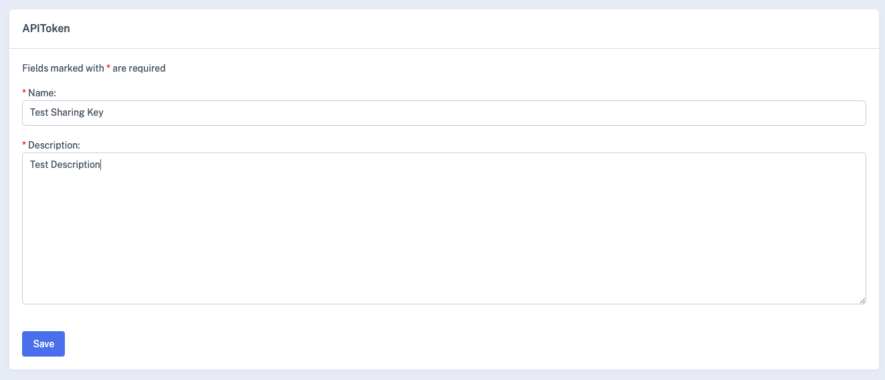
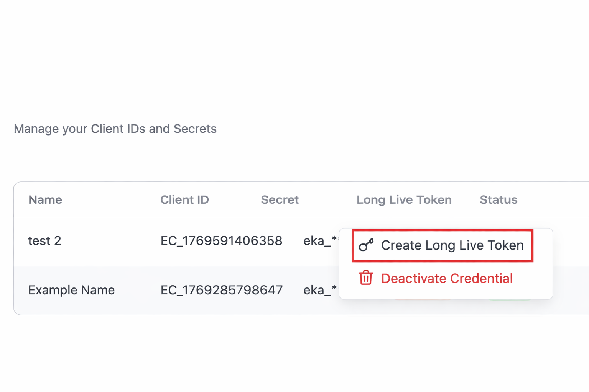
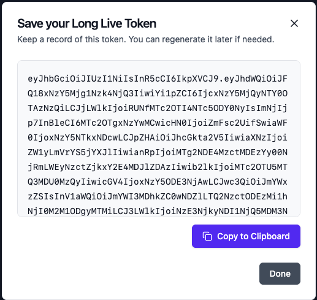

## Overview

The Eka API Authentication process ensures secure access to sensitive healthcare data through a robust authentication process. To interact with the APIs, third-party developers must obtain an access token, use it in all API requests, and handle token expiration efficiently. This guide outlines the essential steps to securely integrate with Eka's API.

### Key Components

- **Client Application:** A third-party application that communicates with Eka's API.
- **Eka API Gateway:** The server-side component that authenticates and processes API requests.

## Setting Up Your Eka Account
This is a **one-time setup** required before you can start using Eka services.

<Note>
<a href="https://login.eka.care/workspace/sign-in/?next=https://console.eka.care&product_type=emr&signup=user_only&tab=sign-up" target="_blank">Click here to visit Eka signup page to get started</a>.
</Note>

<Note>
Eka supports multiple sign-up options such as Google, Apple, Email Address, and Username.
In this guide, we’ll use <strong>Email Address</strong> to walk through the setup steps.
</Note>

<Steps>
    <Step title="Choose Sign Up method of your choice">
        On the welcome screen, select your preferred sign-up option.
        For this guide, we will choose <strong>Continue with Email Address</strong>.

        
    </Step>
    <Step title="Enter your email address">
        Enter your email address and click <strong>Submit</strong>

        
    </Step>
    <Step title="Verify Email Using OTP">
        Enter the one-time password (OTP) sent to your email address and click <strong>Confirm</strong>

        
    </Step>
    <Step title="Create Workspace">
        You need to setup your workspace you use Eka. Enter your details and click on <strong>Next</strong>
        
  </Step>

  <Step title="Automatic Account Creation and Login">
    After submitting workspace details:
    - Your Eka account is created
    - You are automatically logged in
    - Your workspace is ready to use

    
  </Step>
</Steps>

## Creating API Credentials

Once your Eka account is set up, you can use the **Eka Developer Console**
to create and manage API client credentials. <a href="https://console.eka.care" target="_blank">Click here to visit Eka Developer Console</a>.

<Steps>
  <Step title="Open the Eka Console Dashboard">
    Once logged in, you’ll land on the Eka Console dashboard.

    From the **Quick Actions** section, click
    <strong>Manage API Credentials (Client IDs and Secrets)</strong>.

    
  </Step>
    <Step title="Create a New API Client">
   Enter the required required details and click <strong>Create</strong>.
        
  </Step>
    <Step title="Copy Client Credentials">
    After the client is created, securely copy:
    - <code>client_id</code>
    - <code>client_secret</code>

    <Note>
    Store the client secret securely. It will not be shown again.
    </Note>
  </Step>
</Steps>

### Authenticating with Eka APIs
<Steps>
<Step title="Obtain an Access Token">
    Authenticate your client using the [login](/api-reference/authorization/client-login) API. This will return both an access token and a refresh token, which you will use for subsequent API requests.
</Step>

<Step title="Using the Access Token">
    Include the access token in the `auth` header of every API request to authenticate and access Eka’s services
</Step>

<Step title="Handle Token Expiration">
    To ensure continuous access to the API, implement logic to manage token expiration and renewal.

    - If an API request returns a `401 Unauthorized` status code, it indicates that the access token has expired.
    - Use the [refresh token](/api-reference/authorization/refresh-token-v2) API to obtain a new access token and re-authenticate.
</Step>
</Steps>

## Accessing Another Workspace Using a Sharing Key

Eka allows access to another workspace using a **Sharing Key**. Developers who wish to access another workspace must request a Sharing Key
from the owner of that workspace. The Sharing Key can be generated from the Hub.
<a href="https://hub.eka.care/account/" target="_blank">Click here to visit Hub</a>.

<Steps>
  <Step title="Generate a Sharing Key">
    Click on <strong> API Token </strong> to visit page to view and manage sharing keys.
    Click on <strong> Create </strong> and, provide the required information to create sharing key.

    
        
  </Step>

  <Step title="Provide the Sharing Key During Authentication">
After completing this step, continue to
<a href="/api-reference/authorization/getting-started#authenticating-with-eka-apis">
Authenticating with Eka APIs
</a>
to generate an access token (provide <strong> sharing_key </strong> in request body) and start making API requests.

  </Step>
</Steps>

---

## Long Lived Access Token

A Long-Lived Access Token is designed for backend-to-backend (server-to-server) communication between trusted systems.

**Why use a Long-Lived Token?**

- Simplifies authentication for system-to-system API calls
- Eliminates the need to repeatedly generate short-lived access tokens
- Ideal for long-running services and internal integrations

**When should you use this?**

- You are making backend-to-backend API calls
- You do not want to manage token refresh logic
- The integration is between trusted parties

<Steps>
  <Step title="Generate Long Lived Token">
    <a href="https://console.eka.care" target="_blank">Click here to visit Eka Developer Console</a>
    
From the **Quick Actions** section, click
    <strong>Manage API Credentials (Client IDs and Secrets)</strong>.

    Click More options(three dot menu) and click on **Create Long Live Token**

    
  </Step>
  <Step title="Copy Long Live Token">
    After the token is created, securely copy it.

    

    <Note>
    Store the token securely. It will not be shown again.
    </Note>
  </Step>
</Steps>

## Best Practices

- Safeguard your client credentials (client_id and client_secret) at all times.
- Implement a reliable token renewal mechanism to handle token expiration.
- Always include the access token in the `auth` header for all API calls.
- Manage 401 Unauthorized errors gracefully by automatically refreshing the token.
- Ensure that your application complies with all privacy regulations when handling healthcare data.
