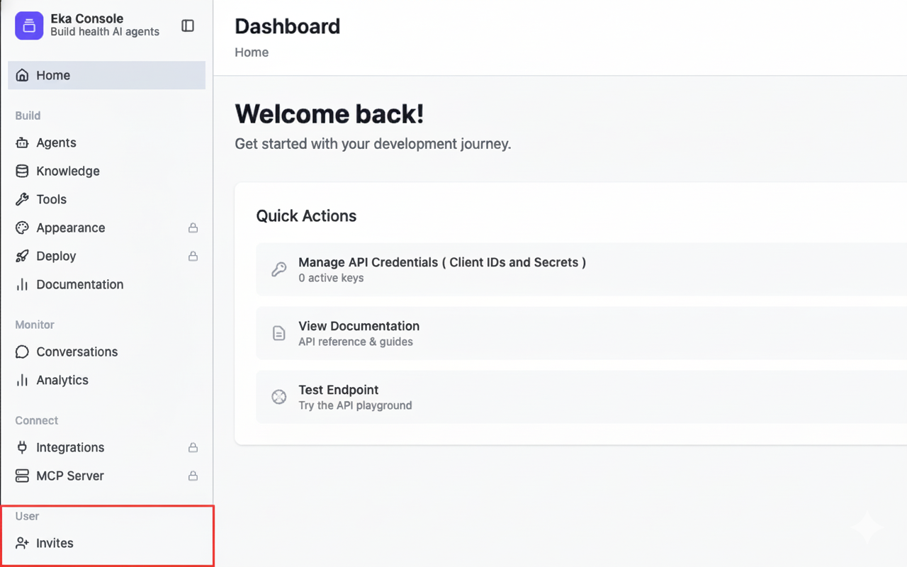
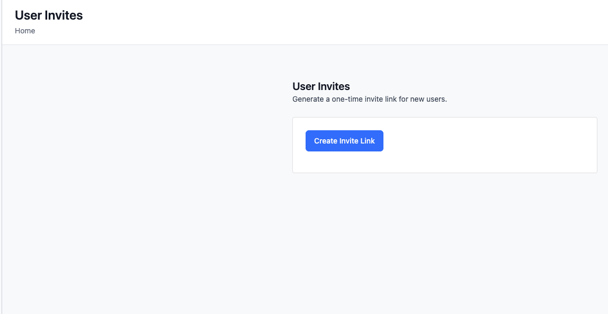
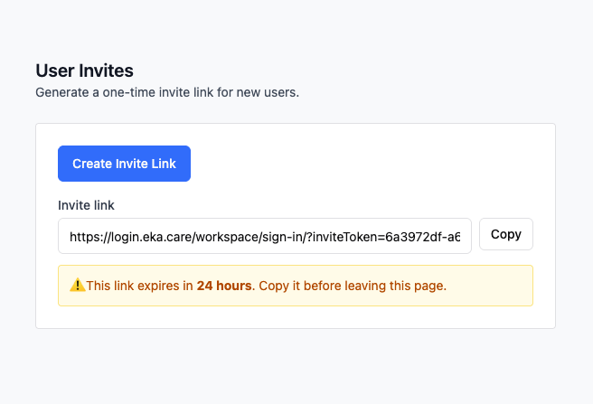
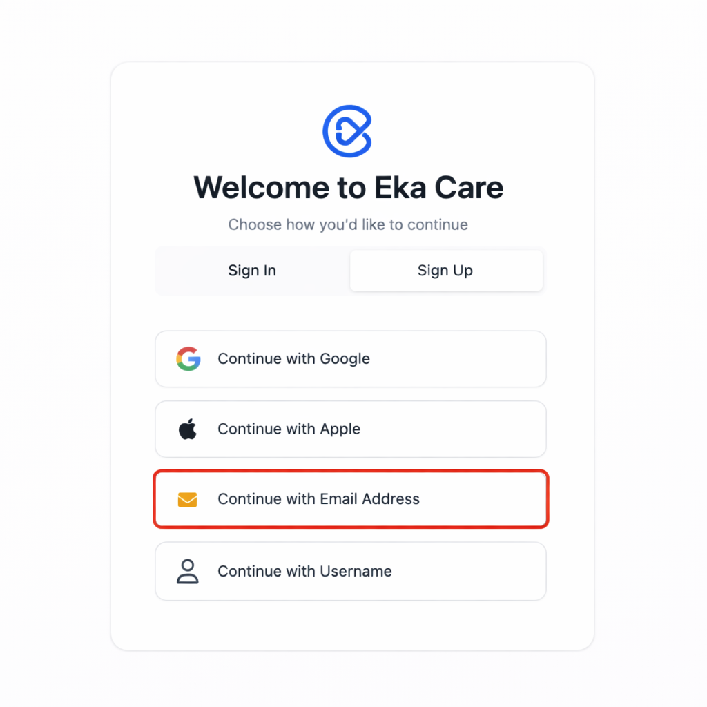
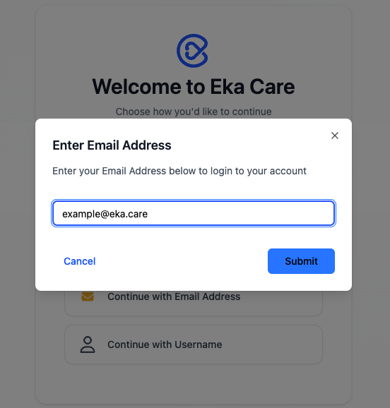
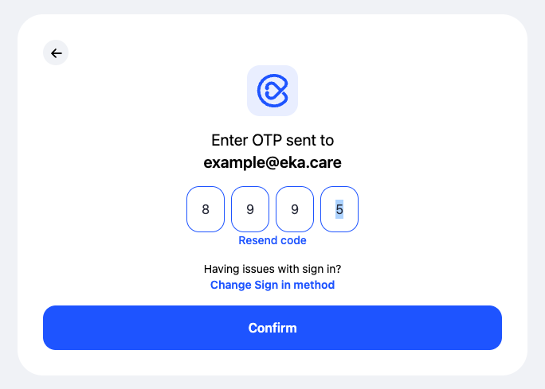
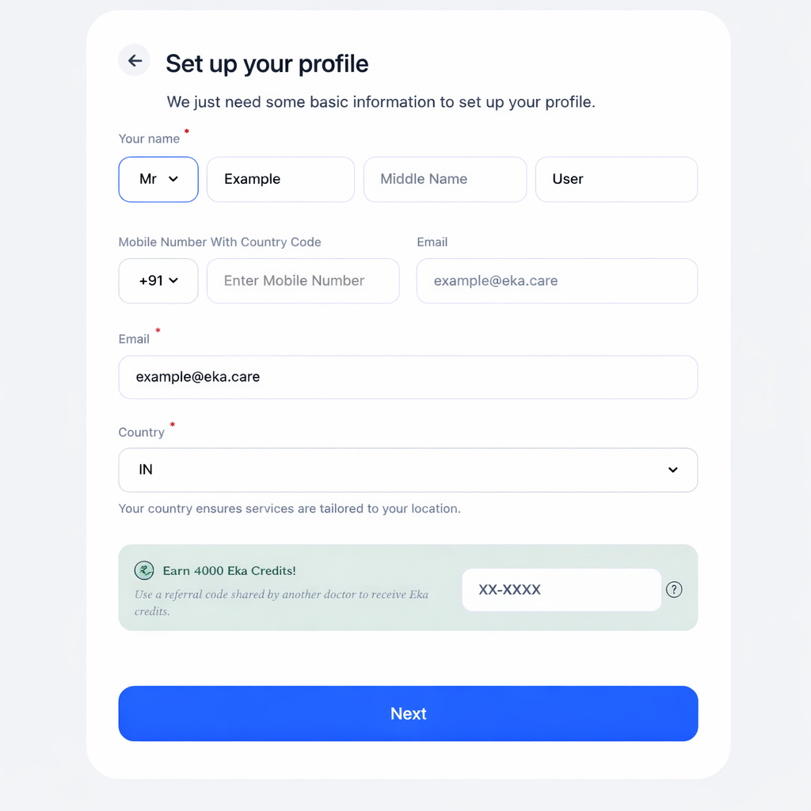

## Overview

The **Invite Flow** allows workspace admins to onboard users into thier workspace using an invite link generated from the **Eka Developer Console**.

## Creating an Invite Link

<Steps>
    <Step title="Open the Eka Developer Console">
        Log in to the Eka Developer Console and navigate to your workspace dashboard.

        <Note>
        You must be an Admin to create invites.
        </Note>
    </Step>

    <Step title="Navigate to Invites">
        From the left sidebar, click on <strong>Invites</strong>.

        
    </Step>

    <Step title="Create Invite Link">
        Click on <strong>Create Invite Link</strong>. Once created, an invite link is generated.

        

        

        <Note>
            Copy the link before leaving the page as it will not be shown again.
        </Note>

        <Note>
            Invite links grant access to a specific product and workspace.
            Do <strong>not</strong> share an invite link with anyone other than the intended recipient.
        </Note>
    </Step>
</Steps>

---

## Consuming an Invite Link

Once generated, the invite link can be shared with the user via email, chat, or any external channel.

Once an invite link is created and shared, the invited user can join the workspace by opening the link.
The system ensures the user is authenticated before granting workspace access.

---

## Invite Authentication Flow

<Steps>
    <Step title="Open the Invite Link">
        The user clicks the invite link shared with them and the user is redirected to the authentication flow.
    </Step>

    <Step title="Choose Sign-Up or Login Method">
        On the authentication screen, the user can choose their preferred method to continue.

        Eka supports multiple options such as:
        - Google
        - Apple
        - Email Address
        - Username

        In this guide, we’ll walk through the flow using <strong>Email Address</strong>.

        
    </Step>

    <Step title="Enter Email Address">
        The user enters their email address and clicks <strong>Submit</strong>.

        
    </Step>

    <Step title="Verify Email Using OTP">
        A one-time password (OTP) is sent to the user’s email address.

        The user enters the OTP and clicks <strong>Confirm</strong> to continue authentication.

        
    </Step>

    <Step title="Set Up Profile Details (New Users Only)">
        Users are prompted to set up their profile.

        

        After entering the profile details, click <strong>Next</strong> to continue.

    </Step>

    <Step title="Invite Validation and Consumption">
        After successful authentication and profile setup, invite is consumed and workspace access is granted to the user.
    </Step>

    <Step title="Redirect to Product">
        Once the invite is successfully consumed, the user is redirected automatically.

        The redirection is based on the invite configuration and includes:
        - The <strong>target product</strong> (for example, EMR)
        - The <strong>specific workspace</strong> for which the invite was created

        This ensures the user lands directly in the correct product context
        without requiring any additional product selection.
    </Step>
</Steps>