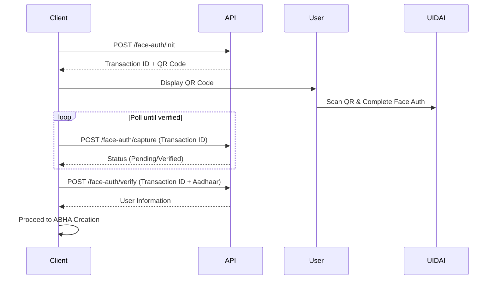

Face Authentication provides a secure and convenient way for users to verify their identity using Aadhaar-based facial recognition. This method allows users to authenticate themselves by scanning a QR code and completing face verification on their mobile device.

## How It Works

The Face Authentication flow consists of three sequential API calls:

<Steps>
  <Step title="Initialize Face Auth">
    Call the [Init API](/api-reference/user-app/abdm-connect/enrollment/face-auth/face-auth-init) to start a face authentication session. This generates a unique transaction ID and a QR code that the user scans with their mobile device.
  </Step>
  <Step title="Poll for Status">
    Use the [Capture API](/api-reference/user-app/abdm-connect/enrollment/face-auth/face-auth-capture) to poll the authentication status. Continue polling until the status changes from `Pending` to `Verified`. This indicates the user has successfully completed face verification on their device.
  </Step>
  <Step title="Retrieve User Information">
    Once verified, call the [Verify API](/api-reference/user-app/abdm-connect/enrollment/face-auth/face-auth-verify) with the user's Aadhaar number to fetch the authenticated user's demographic information. This includes details like name, date of birth, gender, and address.
  </Step>
</Steps>

## Flow Diagram

<CardGroup cols={3}>
  <Card title="Init API" icon="play" href="/api-reference/user-app/abdm-connect/enrollment/face-auth/face-auth-init">
    Start a face authentication session
  </Card>
  <Card title="Capture API" icon="rotate" href="/api-reference/user-app/abdm-connect/enrollment/face-auth/face-auth-capture">
    Poll authentication status
  </Card>
  <Card title="Verify API" icon="check" href="/api-reference/user-app/abdm-connect/enrollment/face-auth/face-auth-verify">
    Retrieve verified user information
  </Card>
</CardGroup>

## Next Steps

After successfully retrieving user information through face authentication, users can proceed to create their ABHA address using the verified demographic details.
