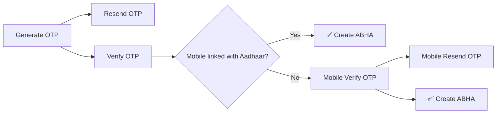
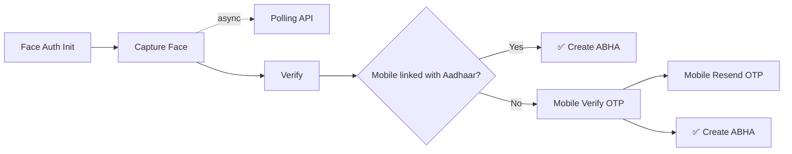
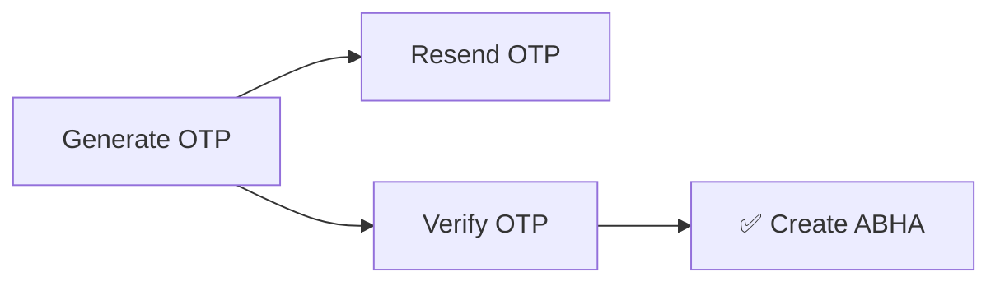

> **Note:** All flows require Authorization from the [Session API](/api-reference/authorization/client-login). The `oid` obtained can be reused across other flows.

---

## Create ABHA

Three methods to create an ABHA account. Each flow runs independently.

### Via Aadhaar OTP

### Via Face Auth

### Via Mobile OTP

---

## Login ABHA

Three methods to login. All methods resolve to `skip_state = abha_end` on success.

<Note>
    The `oid` from login can be reused in other downstream flows.
</Note>

### Via PHR Address

### Via Aadhaar

### Via Mobile

<Note>
    If `skip_state = abha_create` and `len(abha_profiles) > 0`, the client can use the **Auto-Login API** to log into an existing ABHA from `abha_profiles` directly.
</Note>