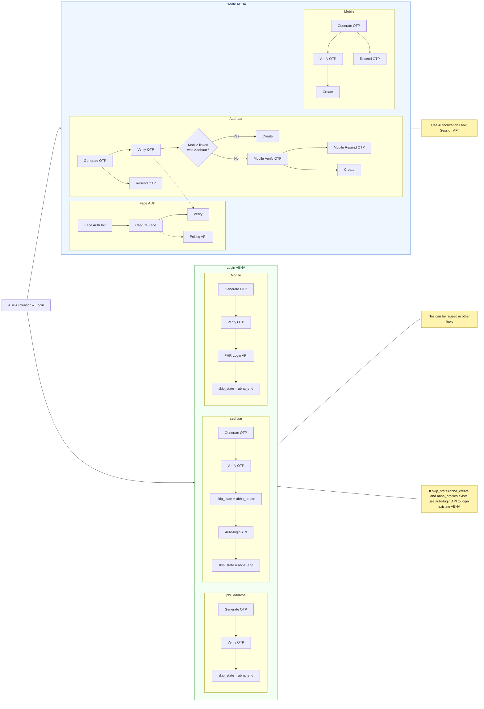

## M1 Flow

```mermaid
%%{init: {"securityLevel": "loose"}}%%
flowchart LR

  A["ABHA Creation & Login"]
  A --> CREATE
  A --> LOGIN

  subgraph CREATE["Create ABHA"]
    direction LR

    subgraph CA1["Aadhaar"]
      direction TB
      C1["Generate OTP"] --> C2["Verify OTP"]
      click C1 "/api-reference/user-app/abdm-connect/enrollment/aadhaar/initiate-registration" "Aadhaar OTP"
      C1 --> C1R["Resend OTP"]
      C2 --> C3{"Mobile linked<br/>with Aadhaar?"}
      C3 -->|Yes| C4["Create"]
      C3 -->|No| C5["Mobile Verify OTP"]
      C5 --> C5R["Mobile Resend OTP"]
      C5 --> C6["Create"]
    end

    subgraph CF1["Face Auth"]
      direction TB
      F1["Face Auth Init"] --> F2["Capture Face"]
      F2 --> F3["Verify"]
      F2 -.-> FP["Polling API"]
    end

    subgraph CM1["Mobile"]
      direction TB
      M1["Generate OTP"] --> M2["Verify OTP"]
      M1 --> M1R["Resend OTP"]
      M2 --> M3["Create"]
    end

    C2 -.-> F3
  end

  subgraph LOGIN["Login ABHA"]
    direction LR

    subgraph LP1["phr_address"]
      direction TB
      P1["Generate OTP"] --> P2["Verify OTP"]
      P2 --> P3["skip_state = abha_end"]
    end

    subgraph LA1["aadhaar"]
      direction TB
      L1["Generate OTP"] --> L2["Verify OTP"]
      L2 --> L3["skip_state = abha_create"]
      L3 --> L4["Auto-login API"]
      L4 --> L5["skip_state = abha_end"]
    end

    subgraph LM1["Mobile"]
      direction TB
      LM2["Generate OTP"] --> LM3["Verify OTP"]
      LM3 --> LM4["PHR Login API"]
      LM4 --> LM5["skip_state = abha_end"]
    end
  end

  N1["Use Authorization Flow Session API"]
  N2["This can be reused in other flows"]
  N3["If skip_state=abha_create and abha_profiles exists,<br/>use auto-login API to login existing ABHA"]

  CREATE --- N1
  LOGIN --- N2
  LOGIN --- N3

  classDef note fill:#fff3b0,stroke:#b59f3b,color:#222,stroke-width:1px;
  classDef section fill:#eef6ff,stroke:#4f8dd8,color:#17375e,stroke-width:1.2px;
  classDef section2 fill:#f3fff2,stroke:#54a95c,color:#1e4a24,stroke-width:1.2px;

  class N1,N2,N3 note;
  class CREATE section;
  class LOGIN section2;
```