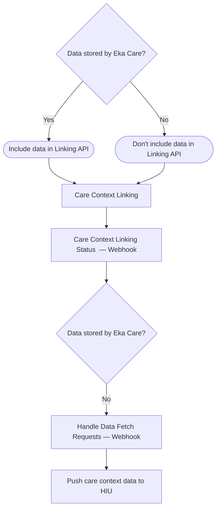

## M2 Flow — Care Context Linking

<Note>
    Steps marked ** Webhook** are asynchronous — your server will receive a callback at the registered webhook URL. You do not need to poll for status.
</Note>

| Step | Type | Description |
|---|---|---|
| Care Context Linking Status | Webhook | Notifies when linking succeeds or fails |
| Handle Data Fetch Requests | Webhook | Triggered when HIU requests data not stored by Eka Care |