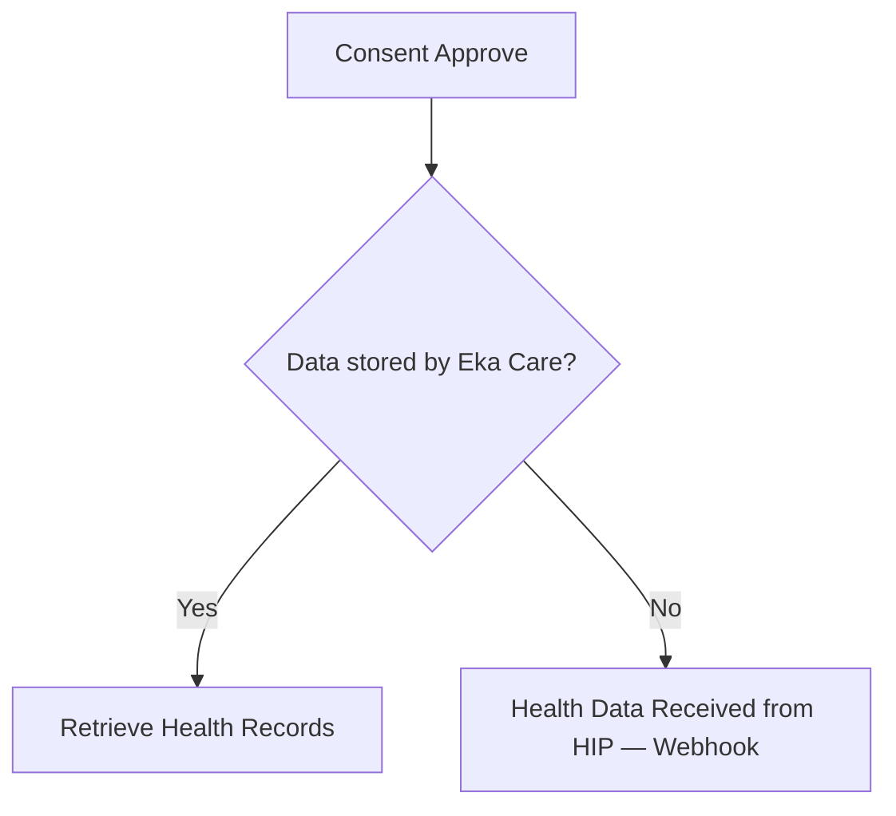

## M3 Flow — Consent & Health Data Retrieval

### HIU — Consent Management

### PHR — Consent Actions

<Note>
    **Consent Approve** is triggered after the HIU creates a consent request. The PHR user can approve, deny, or later revoke the consent.
</Note>

### Data Retrieval

<Note>
    If data is **not** stored by Eka Care, the system waits for the HIP to push data. Your server will receive this via the ** Health Data Received from HIP** webhook.
</Note>

| Step | Type | Description |
|---|---|---|
| Health Data Received from HIP | Webhook | Triggered when HIP pushes health records after consent approval |