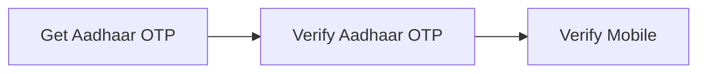
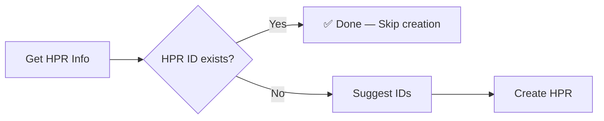
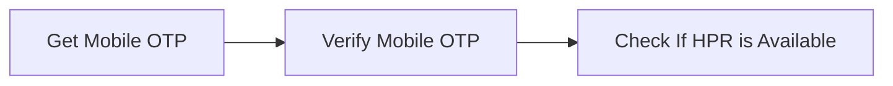
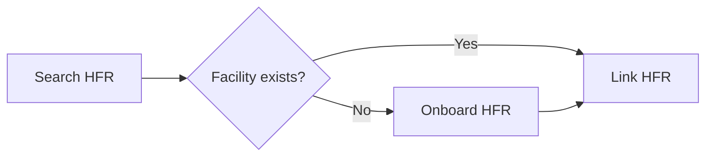
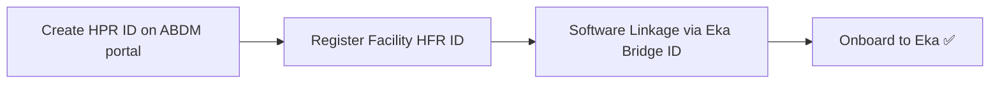

## M4 Flow — Registries & Onboarding

---

## 1. Healthcare Professional Registry (HPR)

### Via Aadhaar Authentication

### HPR ID Creation

### Mobile Login _(alternative entry)_

<Note>
    Use **Get Aadhaar OTP → Verify → Verify Mobile** for first-time registration. Use **Get Mobile OTP → Verify Mobile OTP** for returning professionals logging in via mobile.
</Note>

---

## 2. Health Facility Registry (HFR)

<Note>
    Always **Search HFR** first. If the facility already exists in the ABDM registry, skip onboarding and go directly to **Link HFR**.
</Note>

---

## 3. Onboarding to Eka

<Note>
    This is a **one-time setup** flow. Once the HPR ID and HFR ID are created and registered on the ABDM portal, use the **Software Linkage** step from the facility dashboard to connect via the Eka Bridge ID, then call the Onboard API to complete integration.
</Note>