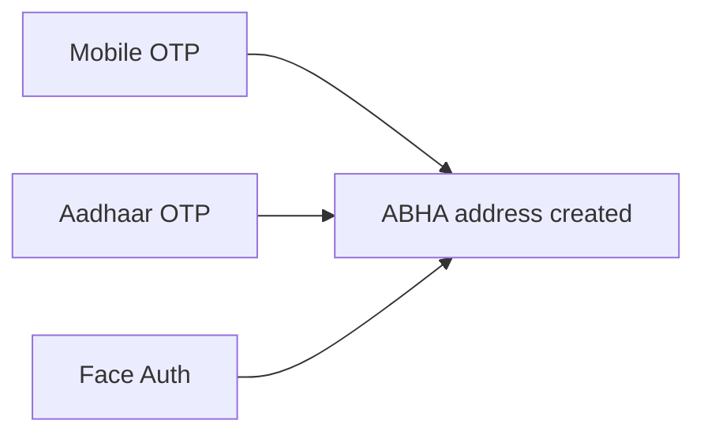

The first thing a PHR app does is give the patient an **ABHA address** (`nisha@abdm`) — the identity every later API call is anchored to. A patient either creates one in your app, or already has one and logs in.

## Create an ABHA address

Three independent methods. Pick whichever your onboarding UX supports; face auth is the fallback when the patient's mobile is not linked to their Aadhaar.

### Via mobile OTP

The lightest path — creates an ABHA address without Aadhaar KYC.

| Step | API |
| --- | --- |
| Generate OTP | [`POST /abdm/na/v1/registration/mobile/init`](/api-reference/user-app/abdm-connect/enrollment/mobile/init) |
| Resend OTP | [`POST /abdm/na/v1/registration/mobile/resend`](/api-reference/user-app/abdm-connect/enrollment/mobile/resend) |
| Verify OTP | [`POST /abdm/na/v1/registration/mobile/verify`](/api-reference/user-app/abdm-connect/enrollment/mobile/verify) |
| Create ABHA | [`POST /abdm/na/v1/registration/mobile/create-phr`](/api-reference/user-app/abdm-connect/enrollment/mobile/create) |

### Via Aadhaar OTP

Produces a KYC-verified 14-digit **ABHA number** alongside the address.

| Step | API |
| --- | --- |
| Generate Aadhaar OTP | [`POST /abdm/na/v1/registration/aadhaar/init`](/api-reference/user-app/abdm-connect/enrollment/aadhaar/initiate-registration) |
| Resend Aadhaar OTP | [`POST /abdm/na/v1/registration/aadhaar/resend`](/api-reference/user-app/abdm-connect/enrollment/aadhaar/aadhaar-resend-otp) |
| Verify Aadhaar OTP | [`POST /abdm/na/v1/registration/aadhaar/verify`](/api-reference/user-app/abdm-connect/enrollment/aadhaar/verify-otp) |
| Verify mobile (if not Aadhaar-linked) | [`POST /abdm/na/v1/registration/aadhaar/mobile/verify`](/api-reference/user-app/abdm-connect/enrollment/aadhaar/mobile-verify) |
| Resend mobile OTP | [`POST /abdm/na/v1/registration/aadhaar/mobile/resend`](/api-reference/user-app/abdm-connect/enrollment/aadhaar/mobile-resend-otp) |
| Create ABHA | [`POST /abdm/na/v1/registration/aadhaar/create-phr`](/api-reference/user-app/abdm-connect/enrollment/aadhaar/create-abha) |
| Log into an existing ABHA found during the flow | [`POST /abdm/na/v1/registration/aadhaar/auto-login`](/api-reference/user-app/abdm-connect/enrollment/aadhaar/auto-login) |

### Via face auth

For patients whose mobile is not linked to Aadhaar and who cannot receive an Aadhaar OTP.

| Step | API |
| --- | --- |
| Overview | [Face Auth](/api-reference/user-app/abdm-connect/enrollment/face-auth/intro) |
| Init | [`POST /abdm/na/v1/face-auth/init`](/api-reference/user-app/abdm-connect/enrollment/face-auth/face-auth-init) |
| Capture | [`POST /abdm/na/v1/face-auth/capture`](/api-reference/user-app/abdm-connect/enrollment/face-auth/face-auth-capture) |
| Verify | [`POST /abdm/na/v1/face-auth/verify`](/api-reference/user-app/abdm-connect/enrollment/face-auth/face-auth-verify) |

[Full M1 creation flow chart →](/api-reference/user-app/abdm-connect/flows/m1)

## Helper APIs

Use these while the patient is still filling the form — they make the difference between a clean signup and a failed one.

| Purpose | API |
| --- | --- |
| Check whether an ABHA address is already taken | [`POST /abdm/na/v1/registration/phr/check`](/api-reference/user-app/abdm-connect/commons/does-health-id-exist) |
| Suggest available ABHA addresses | [`GET /abdm/na/v1/registration/suggest`](/api-reference/user-app/abdm-connect/commons/suggest-abha-address) |
| Resolve a pincode to state / district | [`GET /abdm/v1/registration/pincode/{pincode}`](/api-reference/user-app/abdm-connect/commons/pincode-details) |

## Login to the PHR app

A returning patient logs in with ABHA address, Aadhaar or mobile number. All three converge on `skip_state = abha_end`.

| Step | API |
| --- | --- |
| List available login methods for an identifier | [`POST /abdm/na/v1/profile/login/methods`](/api-reference/user-app/abdm-connect/login/methods) |
| Generate login OTP | [`POST /abdm/na/v1/profile/login/init`](/api-reference/user-app/abdm-connect/login/init) |
| Verify login OTP | [`POST /abdm/na/v1/profile/login/verify`](/api-reference/user-app/abdm-connect/login/verify) |
| Complete PHR login (mobile route, picks one of several ABHAs) | [`POST /abdm/na/v1/profile/login/phr`](/api-reference/user-app/abdm-connect/login/login) |

<Note>
  When login returns `skip_state = abha_create` **and** `abha_profiles` is non-empty, the patient already has ABHAs on that identifier — use the [Auto-Login API](/api-reference/user-app/abdm-connect/enrollment/aadhaar/auto-login) to sign them into an existing one instead of creating a duplicate.
</Note>

## Hold the ABHA Gateway session

Creation and login both open a session with the ABDM gateway. It expires. Any patient-scoped API called without it returns HTTP `491`, and you must re-authenticate with a mobile OTP.

| Step | API |
| --- | --- |
| Check whether a session is still valid **(call this first)** | [`GET /abdm/v1/session/status`](/api-reference/user-app/abdm-connect/session/status) |
| Generate mobile OTP for a new session | [`POST /abdm/v1/session/init`](/api-reference/user-app/abdm-connect/session/init) |
| Verify OTP and get the session token | [`POST /abdm/v1/session/verify`](/api-reference/user-app/abdm-connect/session/verify) |

[User Session overview →](/api-reference/user-app/abdm-connect/session/getting-started)

## Skip the UI entirely

If you don't want to build the OTP screens, the ABHA Web SDK ships the whole creation and login flow as an embeddable, themeable component.

<Card title="M1 — ABHA Web SDK" icon="box-open" href="/SDKs/web-sdk/abha-sdk/get-started">
  Drop-in ABHA creation, login, KYC and Scan & Share, with your own branding.
</Card>

<Note>
  The [`abha.created`](/api-reference/user-app/abdm-connect/webhooks/abha-created) webhook fires on your cloud when an ABHA address is successfully created. Use it to provision the patient in your own database rather than relying on the client-side response.
</Note>
