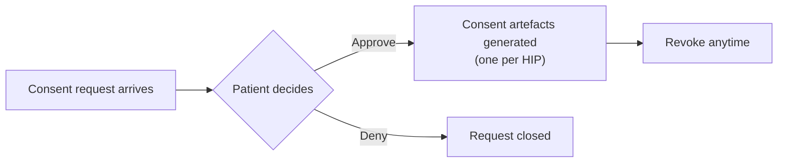

Consent is the whole point of ABDM. A PHR app sits on both sides of it — it **receives** consent requests raised by other HIUs so the patient can act on them, and it **raises** its own requests when it needs to pull records on the patient's behalf.

<Note>
  Every consent operation needs a live ABHA Gateway session. See [User Session](/api-reference/user-app/abdm-connect/session/getting-started).
</Note>

## The patient's request inbox

An ABHA address receives three kinds of request. All three land in the same inbox.

| Kind | Raised by | What it asks for |
| --- | --- | --- |
| **Consent** | Another HIU — a doctor, hospital, insurer, or another PHR app | Permission to view specific care contexts |
| **Subscription** | A PHR app | Ongoing notification whenever a new care context is created |
| **Authorization** | A HIP | Permission to link a document to the patient's ABHA address |

| Purpose | API |
| --- | --- |
| List all requests | [`GET /abdm/v1/requests`](/api-reference/user-app/abdm-connect/patient-requests/list-requests) |
| Get one request's details | [`GET /abdm/v1/request`](/api-reference/user-app/abdm-connect/patient-requests/requests-get-details) |

[Patient Requests overview →](/api-reference/user-app/abdm-connect/patient-requests/getting-started)

## Acting on a consent request

| Action | API |
| --- | --- |
| List consent requests | [`POST /abdm/v1/consents/list`](/api-reference/user-app/abdm-connect/consents/consent-list) |
| Get consent details (including `care_context_id`s) | [`POST /abdm/v1/consents/details`](/api-reference/user-app/abdm-connect/consents/consent-details) |
| Approve — pick which care contexts to share | [`POST /abdm/v1/consents/approve`](/api-reference/user-app/abdm-connect/consents/consent-approve) |
| Deny, with a reason | [`POST /abdm/v1/consents/deny`](/api-reference/user-app/abdm-connect/consents/consent-deny) |
| Revoke a granted consent artefact | [`POST /abdm/v1/consents/revoke`](/api-reference/user-app/abdm-connect/consents/consent-revoke) |

On approval, ABDM generates one **consent artefact per HIP** involved. Revocation is per artefact — the patient can cut off one hospital without revoking the whole consent.

## Raising a consent request as an HIU

Your PHR app fetching records from other providers *is* an HIU operation. Same API a hospital or insurer would use.

| Purpose | API |
| --- | --- |
| Create a consent request | [`POST /abdm/v1/consents/create`](/api-reference/user-app/abdm-connect/consents/consent-create) |

Specify the patient's ABHA address, the purpose, the date range, and which HIPs to fetch from. Once the patient approves, EKA drives all the intermediate gateway callbacks for you — see [Fetch & Display Records](/api-reference/user-app/abdm-connect/phr/records).

## Auto-approval and the health locker

Asking the patient to approve every single record is unusable at scale. An **auto-approval policy** lets the patient authorise a class of requests once — this is what turns your PHR app into the patient's **health locker**: new records flow in without a prompt each time.

| Purpose | API |
| --- | --- |
| Get the current auto-approval policy | [`GET /abdm/v1/consents/auto-approval`](/api-reference/user-app/abdm-connect/consents/auto-approval/get-status) |
| Create or update the policy | [`PATCH /abdm/v1/consents/auto-approval`](/api-reference/user-app/abdm-connect/consents/auto-approval/update-auto-approval-policy) |

When the locker is set up, your cloud receives [`abha.locker_created`](/api-reference/user-app/abdm-connect/webhooks/locker-created) carrying the resulting `auto_approval_id` and `subscription_id` — store both, they identify the standing arrangement.

## Events to handle

| Event | Webhook |
| --- | --- |
| A consent request's status changed | [`abha.consent_update`](/api-reference/user-app/abdm-connect/webhooks/consent-update) |
| Locker (auto-approval + subscription) created | [`abha.locker_created`](/api-reference/user-app/abdm-connect/webhooks/locker-created) |
| Subscription updated | [`abha.subscription_modified`](/api-reference/user-app/abdm-connect/webhooks/subscription-modify) |
| New care context linked under a subscription | [`abha.subscription_notify`](/api-reference/user-app/abdm-connect/webhooks/subscription-notify) |

[Consents overview →](/api-reference/user-app/abdm-connect/consents/getting-started) · [M3 flow chart →](/api-reference/user-app/abdm-connect/flows/m3)

<Card title="M3 — Consent Management Web SDK" icon="box-open" href="/SDKs/web-sdk/consent-management/get-started">
  The full consent inbox and approval UI as an embeddable component.
</Card>
