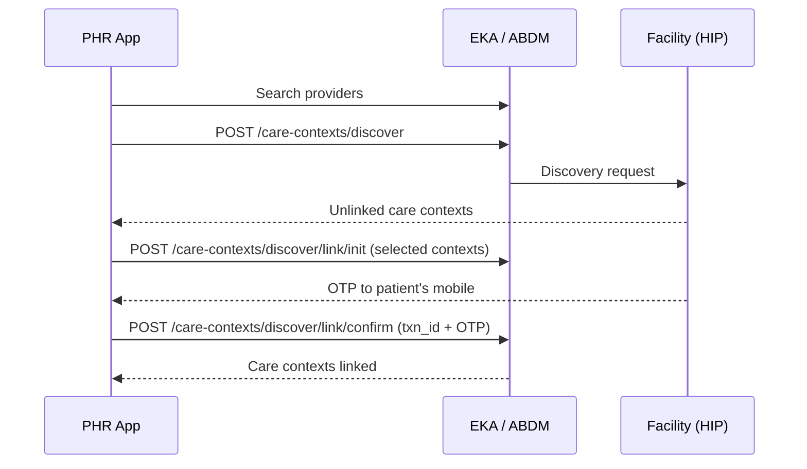

This is what makes a PHR app worth installing: the patient searches a hospital or lab they visited, sees records ABDM knows about but that were never linked, and pulls them into their ABHA account with an OTP.

## Step 1 — Find the facility

The patient picks the hospital, clinic or lab they visited. Providers are ABDM-registered facilities identified by `hip_id`.

| Purpose | API |
| --- | --- |
| Search providers by name | [`GET /abdm/v1/providers`](/api-reference/user-app/abdm-connect/providers/search/providers) |
| Get a single provider's details | [`GET /abdm/v1/provider/{hip_id}`](/api-reference/user-app/abdm-connect/providers/provider) |

[Providers overview →](/api-reference/user-app/abdm-connect/providers/getting-started)

## Step 2 — Discover unlinked care contexts

Send the patient's verified identifiers to the chosen facility. The facility matches them against its own records and returns the care contexts (visits, prescriptions, lab reports) that are not yet linked.

| Purpose | API |
| --- | --- |
| Discover unlinked care contexts | [`POST /abdm/v1/care-contexts/discover`](/api-reference/user-app/abdm-connect/care-contexts/discover/discover) |

## Step 3 — Link with OTP

The patient selects which care contexts to claim. The facility sends an OTP to their registered mobile; confirming it completes the link.

| Step | API |
| --- | --- |
| Initiate linking (facility sends OTP) | [`POST /abdm/v1/care-contexts/discover/link/init`](/api-reference/user-app/abdm-connect/care-contexts/discover/link-init) |
| Confirm linking with `txn_id` + OTP | [`POST /abdm/v1/care-contexts/discover/link/confirm`](/api-reference/user-app/abdm-connect/care-contexts/discover/link-confirm) |

[Care Context Discovery — full flow →](/api-reference/user-app/abdm-connect/care-contexts/discover/introduction)

## The other direction: HIP-initiated linking

A facility can also link records to the patient's ABHA address on its own, without the patient discovering anything. The patient then sees an **authorization request** in their inbox.

| Purpose | API |
| --- | --- |
| List all pending requests (consent, subscription, authorization) | [`GET /abdm/v1/requests`](/api-reference/user-app/abdm-connect/patient-requests/list-requests) |
| Get details of one request | [`GET /abdm/v1/request`](/api-reference/user-app/abdm-connect/patient-requests/requests-get-details) |

[Patient Requests overview →](/api-reference/user-app/abdm-connect/patient-requests/getting-started)

<Note>
  If your PHR app **also** runs facility software (you are a HIP too), the HIP-side APIs are a separate set: [Care Context Link](/api-reference/user-app/abdm-connect/care-contexts/link/hip-linking), [On Discover](/api-reference/user-app/abdm-connect/care-contexts/discover/on_discover), [On Link Init](/api-reference/user-app/abdm-connect/care-contexts/discover/link_on_init), [On Link Confirm](/api-reference/user-app/abdm-connect/care-contexts/discover/link_on_confirm), and [Notify unlinked care contexts](/api-reference/user-app/abdm-connect/care-contexts/records/notify).
</Note>

## Stay linked: subscriptions

Discovery is a one-time pull. To keep receiving new records automatically, the PHR app holds a **subscription** on the patient's ABHA address — once granted, every new care context linked by any HIP notifies your cloud.

| Event | Webhook |
| --- | --- |
| A new care context was linked under an active subscription | [`abha.subscription_notify`](/api-reference/user-app/abdm-connect/webhooks/subscription-notify) |
| Subscription period, categories or status changed | [`abha.subscription_modified`](/api-reference/user-app/abdm-connect/webhooks/subscription-modify) |

<Note>
  `abha.subscription_notify` tells you a record **exists** — it does not deliver it. To read the document, raise a consent request with [Create Consent](/api-reference/user-app/abdm-connect/consents/consent-create), or rely on an auto-approval policy so it happens without prompting the patient. See [Consents & Subscriptions](/api-reference/user-app/abdm-connect/phr/consents).
</Note>
