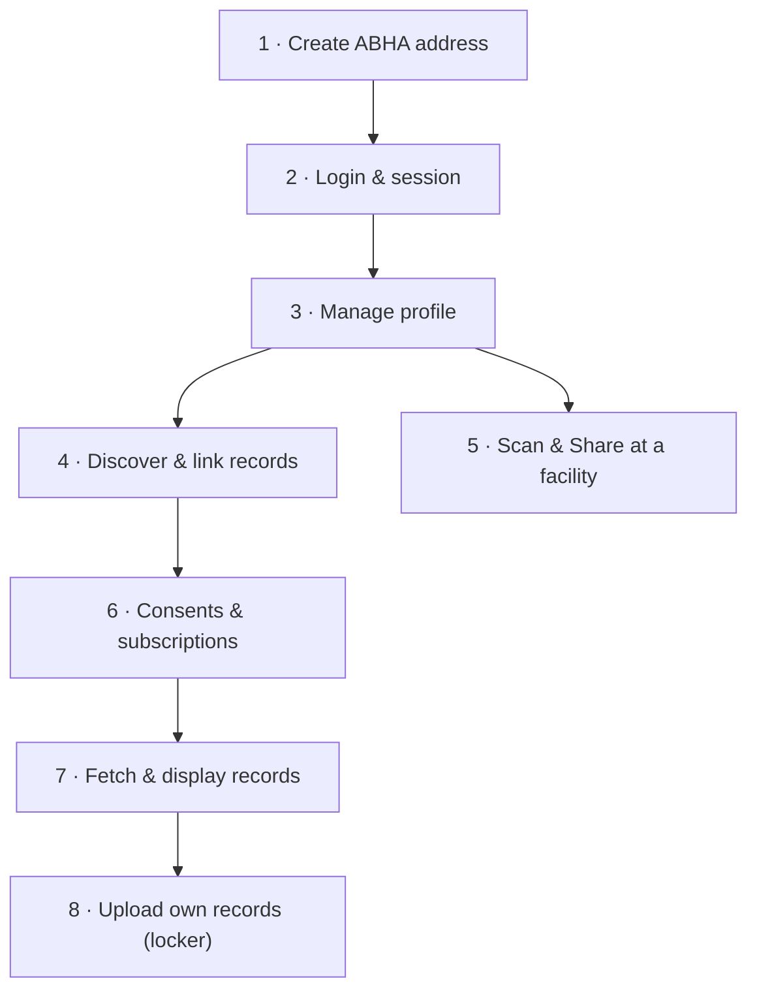

A **PHR (Personal Health Record) app** is the patient-facing side of ABDM. The patient creates an ABHA, logs in, discovers and links records from every facility they have ever visited, decides who gets to see them, and shares their identity at a facility counter.

PHR is a separate ABDM integration track — not one of the HMIS milestones. But it *reuses* APIs from Milestone 1, Milestone 2 and Milestone 3. This page is the single index of which API belongs to which stage of the PHR journey, so you don't have to reassemble it from the milestone trees.

<Note>
  A PHR app is usually **both a HIP and an HIU**: a HIU when it fetches records from other providers on the patient's behalf, and a HIP when it stores records the patient uploaded themselves (the health locker).
</Note>

## The two components

Every PHR integration has two halves, and it matters which half calls what.

<CardGroup cols={2}>
  <Card title="PHR App UI" icon="mobile">
    The patient's app or web client. Handles ABHA creation, login, consent screens, QR scanning, and record display. Never holds your `client_secret`.
  </Card>
  <Card title="PHR App Cloud" icon="cloud">
    Your backend. Holds credentials, calls EKA's ABDM Connect APIs, and **receives webhooks** — the asynchronous half of ABDM (linking status, consent updates, subscription notifications) only ever reaches your cloud.
  </Card>
</CardGroup>

## The patient journey

## Stage-by-stage API map

<CardGroup cols={2}>
  <Card title="1 · ABHA Onboarding" icon="user-plus" href="/api-reference/user-app/abdm-connect/phr/abha-onboarding">
    Create an ABHA address via mobile OTP, Aadhaar OTP or face auth. Log the patient in and hold an ABHA Gateway session.
  </Card>
  <Card title="2 · Profile Management" icon="user" href="/api-reference/user-app/abdm-connect/phr/profile">
    Read and update the ABHA profile, run KYC, render the ABHA card and QR, delete the account.
  </Card>
  <Card title="3 · Scan & Share" icon="qrcode" href="/api-reference/user-app/abdm-connect/phr/scan-and-share">
    Patient scans a facility QR to register instantly and get a token number.
  </Card>
  <Card title="4 · Discover & Link Records" icon="link" href="/api-reference/user-app/abdm-connect/phr/discover-and-link">
    Search providers, discover unlinked care contexts, and link them to the patient's ABHA address.
  </Card>
  <Card title="5 · Consents & Subscriptions" icon="handshake" href="/api-reference/user-app/abdm-connect/phr/consents">
    List, approve, deny and revoke consent requests. Set up auto-approval and the health locker.
  </Card>
  <Card title="6 · Fetch & Display Records" icon="files" href="/api-reference/user-app/abdm-connect/phr/records">
    List linked providers and care contexts, receive FHIR data, and let the patient upload their own documents.
  </Card>
  <Card title="7 · Webhooks" icon="webhook" href="/api-reference/user-app/abdm-connect/phr/webhooks">
    Every asynchronous event a PHR app must handle, in one list.
  </Card>
  <Card title="Errors" icon="circle-exclamation" href="/api-reference/user-app/abdm-connect/errors">
    ABDM, gateway and EKA error codes and what to show the patient.
  </Card>
</CardGroup>

## Where each stage comes from

If you are also tracking ABDM certification, this is how the PHR journey maps onto the milestone trees:

| PHR stage | ABDM milestone | EKA API group |
| --- | --- | --- |
| Create ABHA address, login | M1 | [ABHA Creation & Login](/api-reference/user-app/abdm-connect/registration/intro) |
| Profile, KYC, card & QR | M1 | [Profile Management](/api-reference/user-app/abdm-connect/profile/getting-started) |
| Gateway session | M1 | [User Session](/api-reference/user-app/abdm-connect/session/getting-started) |
| Scan & Share | M1 | [Scan & Share](/api-reference/user-app/abdm-connect/scan-and-share/getting-started) |
| Discover & link records | M2 | [Care Contexts](/api-reference/user-app/abdm-connect/care-contexts/getting-started) |
| Provider search | M2 | [Providers](/api-reference/user-app/abdm-connect/providers/getting-started) |
| Pending requests inbox | M2 | [Patient Requests](/api-reference/user-app/abdm-connect/patient-requests/getting-started) |
| Consents, auto-approval | M3 | [Consents](/api-reference/user-app/abdm-connect/consents/getting-started) |
| Receiving FHIR data | M3 | [Data Sharing](/api-reference/user-app/abdm-connect/care-contexts/ecdh-encryption) |

## Before you start

<Steps>
  <Step title="Get credentials">
    Sign up on the EKA developer console and provision your `client_id` / `client_secret`, then exchange them for an access token.

    [Authorization →](/api-reference/authorization/getting-started)
  </Step>
  <Step title="Register your webhook URL">
    A PHR app cannot work on request/response alone — linking results, consent updates and subscription notifications all arrive as webhooks. Share your endpoint with EKA before you begin testing.

    [PHR webhooks →](/api-reference/user-app/abdm-connect/phr/webhooks)
  </Step>
  <Step title="Understand the ABHA Gateway session">
    Most patient-scoped APIs need a live ABHA Gateway session on top of your partner token. When it expires, those APIs return HTTP `491` and you must re-authenticate the patient.

    [User Session →](/api-reference/user-app/abdm-connect/session/getting-started)
  </Step>
</Steps>
