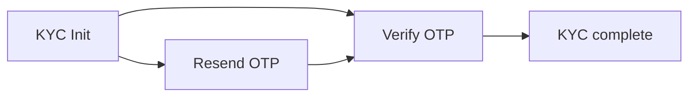

Once the patient is logged in, the PHR app owns their ABHA profile screen — name, address, linked mobile, KYC status, and the ABHA card they show at a facility.

<Note>
  All profile APIs need a live ABHA Gateway session. Check [`GET /abdm/v1/session/status`](/api-reference/user-app/abdm-connect/session/status) before rendering the profile screen; a `491` means you need to re-authenticate.
</Note>

## Profile details

| Purpose | API |
| --- | --- |
| Fetch the full ABHA profile | [`GET /abdm/v1/profile`](/api-reference/user-app/abdm-connect/profile/details/profile-details) |
| Update profile fields | [`PATCH /abdm/v1/profile`](/api-reference/user-app/abdm-connect/profile/details/update-profile) |
| Delete the ABHA account | [`DELETE /abdm/v1/profile`](/api-reference/user-app/abdm-connect/profile/details/delete) |
| Search for an ABHA profile | [`POST /abdm/v1/profile/search`](/api-reference/user-app/abdm-connect/profile/search/search) |

## ABHA card and QR code

The two assets a patient actually shows at a counter. Render them directly in the app.

| Purpose | API |
| --- | --- |
| ABHA card image | [`GET /abdm/v1/profile/asset/card`](/api-reference/user-app/abdm-connect/profile/cards/abha-card) |
| ABHA QR code | [`GET /abdm/v1/profile/asset/qr`](/api-reference/user-app/abdm-connect/profile/cards/qr-code) |

## KYC

An ABHA address created via mobile OTP is not KYC-verified. Run KYC to upgrade it — required before the patient gets a 14-digit ABHA number and full record access.

| Step | API |
| --- | --- |
| Initiate KYC | [`POST /abdm/v1/profile/kyc/init`](/api-reference/user-app/abdm-connect/profile/kyc/kyc-init) |
| Resend OTP | [`POST /abdm/v1/profile/kyc/resend`](/api-reference/user-app/abdm-connect/profile/kyc/kyc-resend) |
| Verify OTP | [`POST /abdm/v1/profile/kyc/verify`](/api-reference/user-app/abdm-connect/profile/kyc/kyc-verify) |

[Profile Management overview →](/api-reference/user-app/abdm-connect/profile/getting-started)

## Link / de-link ABHA address and ABHA number

An ABHA address and a 14-digit ABHA number are linked through KYC — completing Aadhaar KYC on a mobile-created ABHA address associates it with the patient's ABHA number. There is no separate de-link endpoint; deleting the profile is the terminal action.

<Card title="M1 — ABHA Web SDK" icon="box-open" href="/SDKs/web-sdk/abha-sdk/abha-kyc">
  The Web SDK ships the KYC flow as a themeable component if you'd rather not build the OTP screens.
</Card>
