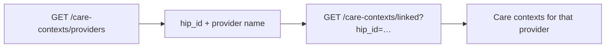

Once records are linked and consent is in place, the PHR app's job is to show them. An ABHA address can carry thousands of documents across dozens of providers, so listing is deliberately two-stage: providers first, then care contexts within a provider.

## Step 1 — List linked providers

| Purpose | API |
| --- | --- |
| All providers the patient has linked records with | [`GET /abdm/v1/care-contexts/providers`](/api-reference/user-app/abdm-connect/care-contexts/providers/providers) |

## Step 2 — List care contexts for a provider

| Purpose | API |
| --- | --- |
| Linked care contexts under a `hip_id` | [`GET /abdm/v1/care-contexts/linked`](/api-reference/user-app/abdm-connect/care-contexts/records/records) |

[Care Contexts overview →](/api-reference/user-app/abdm-connect/care-contexts/getting-started)

## Step 3 — Get the actual data

Listing gives you metadata. To read a document, the patient must have granted consent — then the FHIR bundle reaches you one of two ways, depending on how your integration stores data.

<CardGroup cols={2}>
  <Card title="You store the data" icon="server">
    You receive [`abha.hiu_data_push`](/api-reference/user-app/abdm-connect/webhooks/hiu-data-push) with the encrypted FHIR bundle and the `key_information` needed to decrypt it.

    Register your public keyset first with [`PATCH /abdm/v1/hiu/keyset`](/api-reference/user-app/abdm-connect/care-contexts/hiu-keys) — EKA shares it with the HIP so they can encrypt for you.

    Acknowledge parsing status via [`POST /abdm/v1/hiu/care-context/data/on-push`](/api-reference/user-app/abdm-connect/care-contexts/data-on-push).
  </Card>
  <Card title="EKA stores the data" icon="cloud">
    Nothing to decrypt. Call [`GET /health/api/v1/fhir/retrieve`](/api-reference/user-app/records/retrieve-health-records) with the `care_context_id` as the identifier.

    Get the `care_context_id` from [Consent Details](/api-reference/user-app/abdm-connect/consents/consent-details) after approval.
  </Card>
</CardGroup>

[ECDH encryption explained →](/api-reference/user-app/abdm-connect/care-contexts/ecdh-encryption)

## Patient-uploaded records (health locker)

A PHR app is also a HIP for anything the patient uploads themselves — a scanned prescription, an old lab report. Uploading through the Medical Records APIs **automatically creates a care context**, so the document becomes discoverable and shareable like any facility record.

| Purpose | API |
| --- | --- |
| Get an upload authorization | [`POST /mr/api/v1/docs`](/api-reference/user-app/records/obtain-authorization) |
| Upload the file | [Step 2: Upload Record](/api-reference/user-app/records/upload-records) |
| List the patient's documents | [`GET /mr/api/v1/docs`](/api-reference/user-app/records/list-records) |
| Get one document | [`GET /mr/api/v1/docs/{id}`](/api-reference/user-app/records/describe-record) |
| Update document metadata | [`PATCH /mr/api/v1/docs/{id}`](/api-reference/user-app/records/update-document) |
| Delete a document | [`DELETE /mr/api/v1/docs/{id}`](/api-reference/user-app/records/delete-document) |
| Group documents into a case | [`POST /mr/api/v1/cases`](/api-reference/user-app/records/create-case) |

| Event | Webhook |
| --- | --- |
| Upload finished processing | [`rec.uploaded`](/api-reference/user-app/records/record-uploaded-webhook) |
| Record list changed | [`rec.refresh`](/api-reference/user-app/records/record-refresh-webhook) |

[Medical Records — Add →](/api-reference/user-app/records/create-overview) · [Read →](/api-reference/user-app/records/read-documents)

<Note>
  Storing records on EKA has a second benefit: when an HIU later requests that care context, EKA serves the data automatically and you never receive the [`abha.hip_data_fetch`](/api-reference/user-app/abdm-connect/webhooks/hip-data-fetch) webhook.
</Note>
