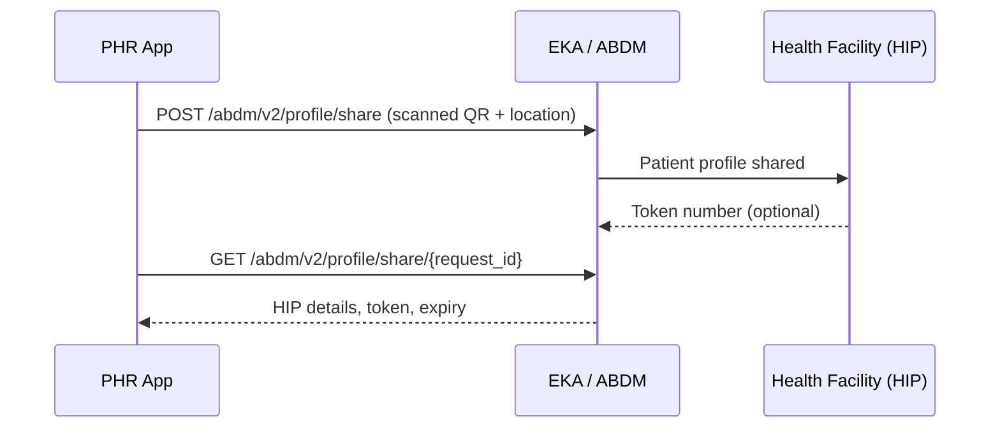

The patient walks up to a registration counter, scans the facility's **Health Facility QR code** in your PHR app, and their ABHA profile lands in the facility's HMIS — no form, no queue. The facility optionally returns a token number.

## APIs

| Step | API |
| --- | --- |
| Share the profile with the scanned facility | [`POST /abdm/v2/profile/share`](/api-reference/user-app/abdm-connect/scan-and-share/phr-scan-share) |
| Poll for the facility's token number | [`GET /abdm/v2/profile/share/{request_id}`](/api-reference/user-app/abdm-connect/scan-and-share/phr-scan-share-token) |

The share request is asynchronous: the first call returns a `request_id`, and the token comes back on the second call once the facility responds. The response carries HIP details, token expiry, and whether the token should be displayed to the patient.

[Scan & Share overview →](/api-reference/user-app/abdm-connect/scan-and-share/getting-started)

<Note>
  The **HIP side** of Scan & Share — receiving a scanned token at the facility counter — is a different integration. If your product also runs the facility's software, see [On-Share](/api-reference/user-app/abdm-connect/scan-and-share/scan-on-share) and the [Scan and Share Token Received](/api-reference/user-app/abdm-connect/webhooks/hip-scan-and-share) webhook.
</Note>

<Card title="M1 — ABHA Web SDK" icon="box-open" href="/SDKs/web-sdk/abha-sdk/abha-s&s">
  Scan & Share is also available as a drop-in SDK component, including the QR scanner.
</Card>
